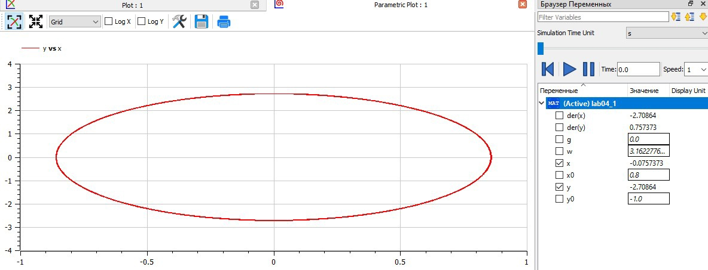
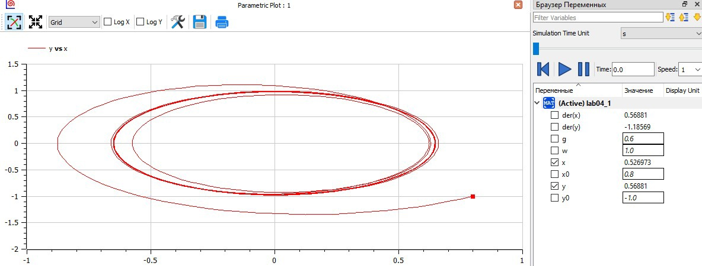

---
## Front matter
lang: ru-RU
title: "Лабораторная работа №4"
author: |
    Рыбалко Элина\inst{1}

institute: |
	\inst{1}RUDN University, Moscow, Russian Federation
  
date: 2022, 28 February, 2022 Murom, Russian Federation  

## Formatting
mainfont: PT Serif
romanfont: PT Serif
sansfont: PT Sans
monofont: PT Mono
toc: false
slide_level: 2
theme: metropolis
header-includes: 
 - \metroset{progressbar=frametitle,sectionpage=progressbar,numbering=fraction}
 - '\makeatletter'
 - '\beamer@ignorenonframefalse'
 - '\makeatother'
aspectratio: 43
section-titles: true
---

# Прагматика выполнения лабораторной работы 

 - Изучение основ математического моделирования.

 - Умение строить траектории движения в теории и визуализировать их.

# Цель выполнения лабораторной работы

Рассмотреть модель линейного гармонического осциллятора, построить фазовые портреты гармонического осциллятора и решенить уравнения гармонического осциллятора.  

# Задачи выполнения лабораторной работы

Постройте фазовый портрет гармонического осциллятора и решение уравнения гармонического осциллятора для следующих случаев:

1. Колебания гармонического осциллятора без затуханий и без действий внешней
силы  $x'' + 10x = 0$

2. Колебания гармонического осциллятора c затуханием и без действий внешней
силы $x'' + 1.5x' + 3x = 0$

3. Колебания гармонического осциллятора c затуханием и под действием внешней
силы $x'' + 0.6x' + x = cos(1.5t)$

На интервале t = [0;62] (шаг 0.05) с начальными условиями $x_{0}=0.8$, $y_{0}=-1$ 

# Результат выполнения лабораторной работы для первого случая 

{ #fig:001} 

# Результат выполнения лабораторной работы для второго случая

{ #fig:002}  

# Результат выполнения лабораторной работы для третьего случая

{ #fig:003} 

# Вывод

Рассмотрели модель линейного гармонического осциллятора, построили фазовые портреты гармонического осциллятора и решенили уравнения гармонического осциллятора.  