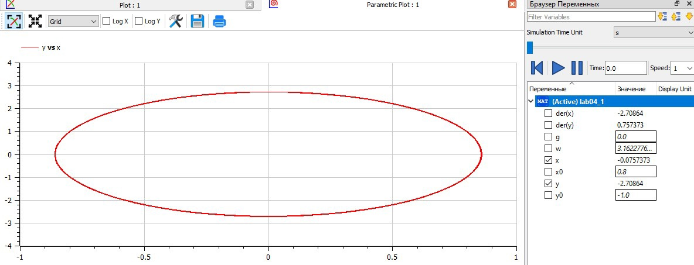
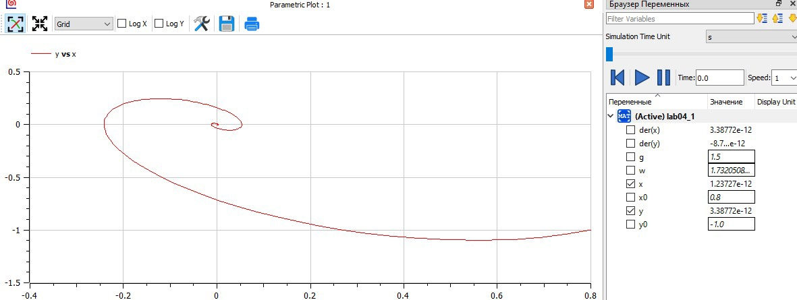
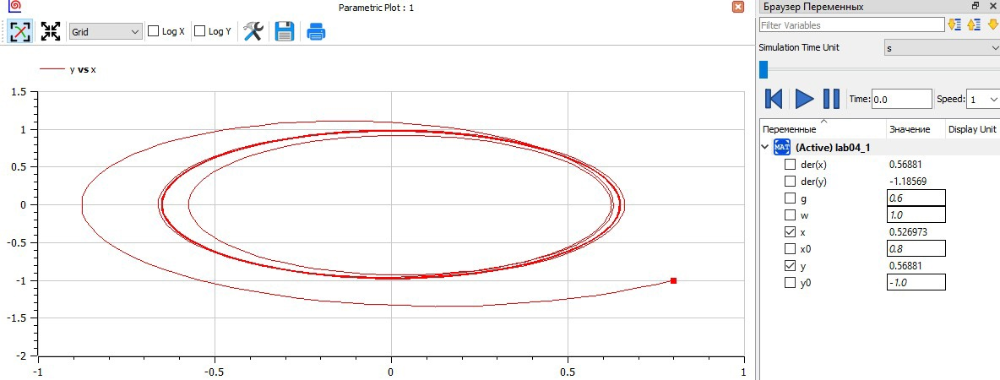

---
# Front matter
lang: ru-RU  
title: "Отчёт по лабораторной работе №4"  
subtitle: "дисциплина: Математическое моделирование"  
author: "Рыбалко Элина Павловна"  

# Generic otions
lang: ru-RU
toc-title: "Содержание"

# Bibliography
bibliography: bib/cite.bib
csl: pandoc/csl/gost-r-7-0-5-2008-numeric.csl

# Pdf output format
toc: true # Table of contents
toc_depth: 2
lof: true # List of figures
lot: true # List of tables
fontsize: 12pt
linestretch: 1.5
papersize: a4
documentclass: scrreprt
## I18n
polyglossia-lang:
  name: russian
  options:
  - spelling=modern
  - babelshorthands=true
polyglossia-otherlangs:
  name: english
### Fonts
mainfont: PT Serif
romanfont: PT Serif
sansfont: PT Sans
monofont: PT Mono
mainfontoptions: Ligatures=TeX
romanfontoptions: Ligatures=TeX
sansfontoptions: Ligatures=TeX,Scale=MatchLowercase
monofontoptions: Scale=MatchLowercase,Scale=0.9
## Biblatex
biblatex: true
biblio-style: "gost-numeric"
biblatexoptions:
  - parentracker=true
  - backend=biber
  - hyperref=auto
  - language=auto
  - autolang=other*
  - citestyle=gost-numeric
## Misc options
indent: true
header-includes:
  - \linepenalty=10 # the penalty added to the badness of each line within a paragraph (no associated penalty node) Increasing the value makes tex try to have fewer lines in the paragraph.
  - \interlinepenalty=0 # value of the penalty (node) added after each line of a paragraph.
  - \hyphenpenalty=50 # the penalty for line breaking at an automatically inserted hyphen
  - \exhyphenpenalty=50 # the penalty for line breaking at an explicit hyphen
  - \binoppenalty=700 # the penalty for breaking a line at a binary operator
  - \relpenalty=500 # the penalty for breaking a line at a relation
  - \clubpenalty=150 # extra penalty for breaking after first line of a paragraph
  - \widowpenalty=150 # extra penalty for breaking before last line of a paragraph
  - \displaywidowpenalty=50 # extra penalty for breaking before last line before a display math
  - \brokenpenalty=100 # extra penalty for page breaking after a hyphenated line
  - \predisplaypenalty=10000 # penalty for breaking before a display
  - \postdisplaypenalty=0 # penalty for breaking after a display
  - \floatingpenalty = 20000 # penalty for splitting an insertion (can only be split footnote in standard LaTeX)
  - \raggedbottom # or \flushbottom
  - \usepackage{float} # keep figures where there are in the text
  - \floatplacement{figure}{H} # keep figures where there are in the text
---

# Цель работы

Рассмотреть модель линейного гармонического осциллятора, построить фазовые портреты гармонического осциллятора и решенить уравнения гармонического осциллятора.  

## Объект исследования

Моедль линейного гармонического осциллятора.

## Предмет исследования

Задачи о моделе гармонических колебаний.

# Теоретическое введение

Движение грузика на пружинке, маятника, заряда в электрическом контуре, а
также эволюция во времени многих систем в физике, химии, биологии и других
науках при определенных предположениях можно описать одним и тем же
дифференциальным уравнением, которое в теории колебаний выступает в качестве
основной модели. Эта модель называется линейным гармоническим осциллятором.
Уравнение свободных колебаний гармонического осциллятора имеет
следующий вид:  
$x'' + 2 \gamma x' + w_{0}^2x = 0$  
где $x$ – переменная, описывающая состояние системы (смещение грузика, заряд
конденсатора и т.д.),  $\gamma$  – параметр, характеризующий потери энергии (трение в
механической системе, сопротивление в контуре), $w_{0}$ – собственная частота
колебаний, $t$ – время.  
 Предыдущее уравнение - линейное однородное дифференциальное уравнение
второго порядка и оно является примером линейной динамической системы.  
При отсутствии потерь в системе ($\gamma  = 0$) получаем уравнение консервативного осциллятора энергия колебания которого сохраняется во времени: $x'' + w_{0}^2x = 0$. Для однозначной разрешимости уравнения второго порядка необходимо
задать два начальных условия $x(t_{0}) = x_{0}$ и $x'(t_{0}) = y_{0}$.  
  Уравнение второго порядка можно представить в виде системы двух
уравнений первого порядка: 
$$
\left\{ 
\begin{array}{c}
x' = y \\ 
y' = -w_{0}^2x 
\end{array}
\right. 
$$
и тогда начальные условия примут вид: 
$$
\left\{ 
\begin{array}{c}
x(t_{0}) = x_{0} \\ 
y(t_{0}) = y_{0}
\end{array}
\right. 
$$[[1]](#список-литературы) 

# Задание

1. Построить решение уравнения гармонического осциллятора без затухания.
2. Записать уравнение свободных колебаний гармонического осциллятора с затуханием, построить его решение. Построить фазовый портрет гармонических колебаний с затуханием.
3. Записать уравнение колебаний гармонического осциллятора, если на систему действует внешняя сила, построить его решение. Построить фазовый портрет колебаний с действием внешней силы.

# Выполнение лабораторной работы

## 1. Постановка задачи

**[Вариант 22]**

Постройте фазовый портрет гармонического осциллятора и решение уравнения
гармонического осциллятора для следующих случаев:

1. Колебания гармонического осциллятора без затуханий и без действий внешней
силы  $x'' + 10x = 0$

2. Колебания гармонического осциллятора c затуханием и без действий внешней
силы $x'' + 1.5x' + 3x = 0$

3. Колебания гармонического осциллятора c затуханием и под действием внешней
силы $x'' + 0.6x' + x = cos(1.5t)$

На интервале t = [0;62] (шаг 0.05) с начальными условиями $x_{0}=0.8$, $y_{0}=-1$ 


## 2. Построение графиков 

### 2.1. Листинги программ в OpenModelica

1. Колебания гармонического осциллятора без затуханий и без действий внешней
силы  $x'' + 10x = 0$

Программа для первого случая.

```
model lab04_1
//Параметры осциллятора
//x'' + g* x' + w^2* x = f(t)
//w - частота
//g - затухание
  parameter Real w = sqrt(10.00); // 3; 1.00
  parameter Real g = 0.00; // 1.5; 0.6
  
  parameter Real x0 = 0.8;
  parameter Real y0 = -1;
  
  Real x(start=x0);
  Real y(start=y0);
  
//правая часть уравнения f(t)
function f
  input Real t;
  output Real res;
algorithm
  res := 0; //1 и 2 случай
  // res := cos(1.5*t); // 3 случай
end f;

equation
  der(x) = y;
  der(y) = -w*w*x - g*y - f(time);

end lab04_1;
 
```

2. Колебания гармонического осциллятора c затуханием и без действий внешней
силы $x'' + 1.5x' + 3x = 0$

```
model lab04_2
//Параметры осциллятора
//x'' + g* x' + w^2* x = f(t)
//w - частота
//g - затухание
  parameter Real w = sqrt(3.00); // 1.00
  parameter Real g = 1.5; // 0.6
  
  parameter Real x0 = 0.8;
  parameter Real y0 = -1;
  
  Real x(start=x0);
  Real y(start=y0);
  
//правая часть уравнения f(t)
function f
  input Real t;
  output Real res;
algorithm
  res := 0; //1 и 2 случай
  // res := cos(1.5*t); // 3 случай
end f;

equation
  der(x) = y;
  der(y) = -w*w*x - g*y - f(time);

end lab04_2;
 
```

3. Колебания гармонического осциллятора c затуханием и под действием внешней
силы $x'' + 0.6x' + x = cos(1.5t)$

```
model lab04_3
//Параметры осциллятора
//x'' + g* x' + w^2* x = f(t)
//w - частота
//g - затухание
  parameter Real w = sqrt(1.00); 
  parameter Real g = 0.6; 
  
  parameter Real x0 = 0.8;
  parameter Real y0 = -1;
  
  Real x(start=x0);
  Real y(start=y0);
  
//правая часть уравнения f(t)
function f
  input Real t;
  output Real res;
algorithm
  res := cos(1.5*t); 
end f;

equation
  der(x) = y;
  der(y) = -w*w*x - g*y - f(time);

end lab04_3;
 
```

### 2.2. Полученные графики  
После запуска кода программы получили следующие графики для первого и второго случая соответственно  (см. рис. -@fig:001, -@fig:002 и -@fig:003).

{ #fig:001} 

{ #fig:002} 

{ #fig:003} 

### 2.3. Анализ результатов:

Как можно заметить из рис. -@fig:001 из-за отсутствия затухания график зацикленный. В двух остальных случая график изменятся благодаря затуханию (см.рис. -@fig:002), а также благодаря воздействию внешних сил (см.рис. -@fig:003).

## Вопросы к лабораторной работе

**1. Запишите простейшую модель гармонических колебаний.**

$x'' + 2 \gamma x' + w_{0}^2x = 0$ 
Или же при отсутствии затухания $x'' + w_{0}^2x = 0$ 

**2. Дайте определение осциллятора.**

Осциллятор - это модель, в качестве которой выступает дифференциальное уравнение, описывающего движение чего-либо (грузика на пружинке, маятника, заряда и т.д.) или эволюцию во времени многих систем при определённых предположения в теории колебаний.

**3. Запишите модель математического маятника.**

$x'' + 2 \gamma x' + w_{0}^2x = 0$ 

**4. Запишите алгоритм перехода от дифференциального уравнения второго порядка к двум дифференциальным уравнениям первого порядка.**

Уравнение второго порядка можно представить в виде системы двух
уравнений первого порядка:
$$
\left\{ 
\begin{array}{c}
x' = y \\ 
y' = -w_{0}^2x 
\end{array}
\right. 
$$
и тогда начальные условия примут вид: 
$$
\left\{ 
\begin{array}{c}
x(t_{0}) = x_{0} \\ 
y(t_{0}) = y_{0}
\end{array}
\right. 
$$

**5. Что такое фазовый портрет и фазовая траектория?**

Фазовая траектория - это гладкая кривая в фазовой плоскости, отвечающая решению уравнения движения как функции времении.
Фазовый портрет - это набор фазовых траекторий или же множество различных решений на одной фазовой плоскости.

# Вывод

Рассмотрели модель линейного гармонического осциллятора, построили фазовый портреты гармонического осциллятора и решенили уравнения гармонического осциллятора. 

# Список литературы {.unnumbered}

1. [Модель гармонических колебаний](https://docviewer.yandex.ru/view/289699604/?*=d1HOypCgzvNHuNFvwp1dAceIibV7InVybCI6Imh0dHBzOi8vc3R1ZC1zY2kucnVkbi5ydS9wbHVnaW5maWxlLnBocC8xNjg3Ni9tb2RfZm9sZGVyL2NvbnRlbnQvMC9wcm9qZWN0MDMucGRmP2ZvcmNlZG93bmxvYWQ9MSIsInRpdGxlIjoicHJvamVjdDAzLnBkZj9mb3JjZWRvd25sb2FkPTEiLCJub2lmcmFtZSI6dHJ1ZSwidWlkIjoiMjg5Njk5NjA0IiwidHMiOjE2NDYwNzQzMDgyNjAsInl1IjoiNDM5NDc5NDA1MTU5NjE3ODEwNCIsInNlcnBQYXJhbXMiOiJ0bT0xNjQ2MDc0MzA0JnRsZD1ydSZsYW5nPXJ1Jm5hbWU9cHJvamVjdDAzLnBkZj9mb3JjZWRvd25sb2FkPTEmdGV4dD0lRDAlOUMlRDAlQkUlRDAlQjQlRDAlQjUlRDAlQkIlRDElOEMrJUQwJUIzJUQwJUIwJUQxJTgwJUQwJUJDJUQwJUJFJUQwJUJEJUQwJUI4JUQxJTg3JUQwJUI1JUQxJTgxJUQwJUJBJUQwJUI4JUQxJTg1KyVEMCVCQSVEMCVCRSVEMCVCQiVEMCVCNSVEMCVCMSVEMCVCMCVEMCVCRCVEMCVCOCVEMCVCOSslRDAlOTQlRDAlQjIlRDAlQjglRDAlQjYlRDAlQjUlRDAlQkQlRDAlQjglRDAlQjUrJUQwJUIzJUQxJTgwJUQxJTgzJUQwJUI3JUQwJUI4JUQwJUJBJUQwJUIwKyVEMCVCRCVEMCVCMCslRDAlQkYlRDElODAlRDElODMlRDAlQjYlRDAlQjglRDAlQkQlRDAlQkElRDAlQjUlMkMrJUQwJUJDJUQwJUIwJUQxJThGJUQxJTgyJUQwJUJEJUQwJUI4JUQwJUJBJUQwJUIwJTJDKyVEMCVCNyVEMCVCMCVEMSU4MCVEMSU4RiVEMCVCNCVEMCVCMCslRDAlQjIrJUQxJThEJUQwJUJCJUQwJUI1JUQwJUJBJUQxJTgyJUQxJTgwJUQwJUI4JUQxJTg3JUQwJUI1JUQxJTgxJUQwJUJBJUQwJUJFJUQwJUJDKyVEMCVCQSVEMCVCRSVEMCVCRCVEMSU4MiVEMSU4MyVEMSU4MCVEMCVCNSUyQyslRDAlQjArJUQxJTgyJUQwJUIwJUQwJUJBJUQwJUI2JUQwJUI1KyVEMSU4RCVEMCVCMiVEMCVCRSVEMCVCQiVEMSU4RSVEMSU4NiVEMCVCOCVEMSU4RislRDAlQjIlRDAlQkUrJUQwJUIyJUQxJTgwJUQwJUI1JUQwJUJDJUQwJUI1JUQwJUJEJUQwJUI4KyVEMCVCQyVEMCVCRCVEMCVCRSVEMCVCMyVEMCVCOCVEMSU4NSslRDElODElRDAlQjglRDElODElRDElODIlRDAlQjUlRDAlQkMrJUQwJUIyKyVEMSU4NCVEMCVCOCVEMCVCNyVEMCVCOCVEMCVCQSVEMCVCNSUyQyslRDElODUlRDAlQjglRDAlQkMlRDAlQjglRDAlQjglMkMrJUQwJUIxJUQwJUI4JUQwJUJFJUQwJUJCJUQwJUJFJUQwJUIzJUQwJUI4JUQwJUI4KyVEMCVCOCslRDAlQjQlRDElODAlRDElODMlRDAlQjMlRDAlQjglRDElODUrJUQwJUJEJUQwJUIwJUQxJTgzJUQwJUJBJUQwJUIwJUQxJTg1KyVEMCVCRiVEMSU4MCVEMCVCOCslRDAlQkUlRDAlQkYlRDElODAlRDAlQjUlRDAlQjQlRDAlQjUlRDAlQkIlRDAlQjUlRDAlQkQlRDAlQkQlRDElOEIlRDElODUrJUQwJUJGJUQxJTgwJUQwJUI1JUQwJUI0JUQwJUJGJUQwJUJFJUQwJUJCJUQwJUJFJUQwJUI2JUQwJUI1JUQwJUJEJUQwJUI4JUQxJThGJUQxJTg1KyVEMCVCQyVEMCVCRSVEMCVCNiVEMCVCRCVEMCVCRSslRDAlQkUlRDAlQkYlRDAlQjglRDElODElRDAlQjAlRDElODIlRDElOEMrJUQwJUJFJUQwJUI0JUQwJUJEJUQwJUI4JUQwJUJDKyVEMCVCOCslRDElODIlRDAlQjUlRDAlQkMrJUQwJUI2JUQwJUI1KyVEMCVCNCVEMCVCOCVEMSU4NCVEMSU4NCVEMCVCNSVEMSU4MCVEMCVCNSVEMCVCRCVEMSU4NiVEMCVCOCVEMCVCMCVEMCVCQiVEMSU4QyVEMCVCRCVEMSU4QiVEMCVCQyslRDElODMlRDElODAlRDAlQjAlRDAlQjIlRDAlQkQlRDAlQjUlRDAlQkQlRDAlQjglRDAlQjUlRDAlQkMlMkMrJUQwJUJBJUQwJUJFJUQxJTgyJUQwJUJFJUQxJTgwJUQwJUJFJUQwJUI1KyVEMCVCMislRDElODIlRDAlQjUlRDAlQkUlRDElODAlRDAlQjglRDAlQjgmdXJsPWh0dHBzJTNBLy9zdHVkLXNjaS5ydWRuLnJ1L3BsdWdpbmZpbGUucGhwLzE2ODc2L21vZF9mb2xkZXIvY29udGVudC8wL3Byb2plY3QwMy5wZGYlM0Zmb3JjZWRvd25sb2FkJTNEMSZscj0xMDY2MCZtaW1lPXBkZiZsMTBuPXJ1JnNpZ249NGM5NDc0NTM2YTRkYTY4MmNlNGFiYzhhZDc5OWVjYjIma2V5bm89MCJ9&amp;lang=ru)
2. [Руководство по формуле Cmd Markdown](https://russianblogs.com/article/26051452570/)
3. [Математическое моделирование при решении задач](https://urok.1sept.ru/articles/609795)
4. [С.В. Каштаева, Математическое моделирование / Учебное пособие](http://pgsha.ru:8008/books/study/%CA%E0%F8%F2%E0%E5%E2%E0%20%D1.%20%C2.%20%CC%E0%F2%E5%EC%E0%F2%E8%F7%E5%F1%EA%EE%E5%20%EC%EE%E4%E5%EB%E8%F0%EE%E2%E0%ED%E8%E5..pdf)
5. [Руководство по оформлению Markdown файлов](https://gist.github.com/Jekins/2bf2d0638163f1294637)